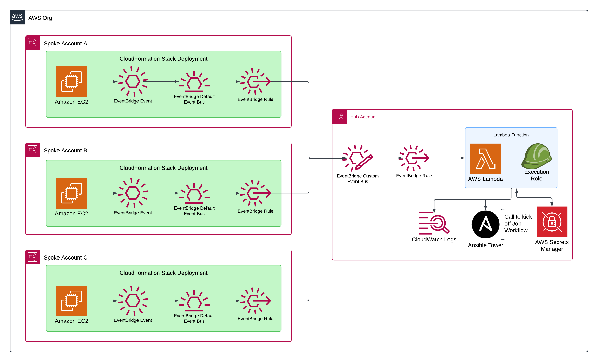

# Retrospective
## :thinking: Problem Statement
### Zombie Host in Ansible Inventories
Currently EC2 hosts being registered into Ansible Inventories
aren't being removed once EC2 has been terminated. This has 
been causing issues with App deployments as well as EC2 
Configuration.

Teams are having to go through Inventories manually to remove
any host that are no longer reachable. Causing delays in App development
and misconfigurations on some host.

